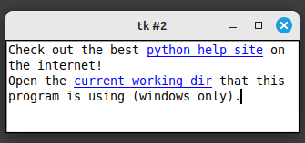

# Tkinter-Toys

Random examples of tkinter snippets

## Some widgets

<table style="padding:10px">
  <tr>
    <td>
         
        <b><a href="widgets/tk_rounded_corners">Rounded corners</a></b> 
        A tkinter main window with rounded corners (Windows only).
    </td>
    <td width=30></td>
    <td>
         
        <b><a href="widgets/progressbar_pause">Progressbar demo</a></b> 
        A demo of pausing and changing the color of a progressbar.
    </td>
    <td width=30></td>
    <td>
         
        <b><a href="widgets/longpress/">Long Press</a></b> 
        A tkinter button or keyboard key that repeats the same command over and over as long as the button is held down.
    </td>
  </tr>
  <tr>
    <td>
         
        <b><a href="widgets/text_autogrow/">Grow Text</a></b> 
        A Text or ScrolledText widget that will expand vertically depending on how much text is in it.
    </td>
    <td width=30></td>
    <td>
         
        <b><a href="widgets/text_hyperlink/">Text Hyperlink</a></b> 
        Demo of how to make a hyperlink in a Text widget.
    </td>
    <td width=30></td>
    <td>
         
        <b><a href="widgets/marquee/">Marquee</a></b> 
        A Label that scrolls text left to right like a marquee.
    </td>
  </tr>
  <tr>
    <td>
         
        <b><a href="widgets/entry_autocomplete/">Autocomplete</a></b> 
        An entry widget that you can provide with a list of options and have it provide suggestions while typing.
    </td>
    <td width=30></td>
    <td>
         
        <b><a href="widgets/labelframe_select/">Select Labelframe</a></b> 
        A labelframe with a checkbutton, so that you can disable or collapse the content.
    </td>
    <td width=30></td>
    <td>
         
        <b><a href="widgets/listbox_dualchoice/">Dualchoice</a></b> 
        The classic double listbox to choose a number of values and an order.
    </td>
  </tr>
  <tr>
    <td>
       
      <b><a href="widgets/listbox_multi/">Multi-column Listbox</a></b> 
      A multicolumn Listbox made by packing normal listboxes together with a common scrollbar.
    </td>
    <td width=30></td>
    <td>
        <b><a href="widgets/geometry_keeper/">Geometry Keeper</a></b> 
        Code to remember the window geometry for the next time you open the program.
    </td>
    <td width=30></td>
    <td>
    </td>
  </tr>
</table>

## Some tools
* [**Cursors**](tools/tk_cursors) = Show all the available cursors available in tkinter.
* [**Colors**](tools/tk_named_colors) = Show all the named colors in tkinter
* [**Winfo functions**](tools/tk_winfo_display/) = Show the outputs from various winfo functions
* [**Keypress**](tools/tk_keypress_explorer/) = Show all the attributes of a keypress Event.
* [**Help docs**](tools/list_attributes/) = Print the help doc for all attributes of an object.

## Some small fun programs
* [**Sudoku**](demoprograms/sudoku_gui) = Draws an even grid. Mostly a demo of the undocumented "uniform" feature.
* [**Login window**](demoprograms/loginwindow) = A demo of how to swap frames, in this case to make a password login window before showing the main application.
* [**Word map**](demoprograms/word_map) = Place words on a canvas, move them around, then calculate the distance between them.
* [**Icon Maker**](https://github.com/socal-nerdtastic/IconMaker) = Make tkinter icons embedded into the source code.
* [**Image to source**](https://github.com/socal-nerdtastic/TkImageConvert) = Make tkinter images embedded into the source code.
* [**Screenshot clipper**](https://github.com/socal-nerdtastic/ScreenshotClip) = Screenshot and clip tool
* [**Measure tool**](demoprograms/measure_tool) = A tool to measure random lines drawn on an image.
* [**Hex Viewer tool**](https://github.com/socal-nerdtastic/HexView) = Vey basic hex viewer that allows you to set the line length.
