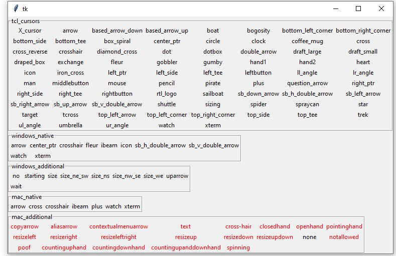

# cursors.pyw

This tkinker program will help you choose which cursor to use.

It displays a list of all possible cursors. Hover your mouse over each name to see what it looks like.

Cursors that are not available for your system are in red.

To use, simply run the `cursors.pyw` program. On a normal, default install of python you can just doubleclick the file to run it. 

To use a cursor in your program set the `cursor` option of the widget: 

    tk.Label(root, text="this is a link style", cursor="hand2")

