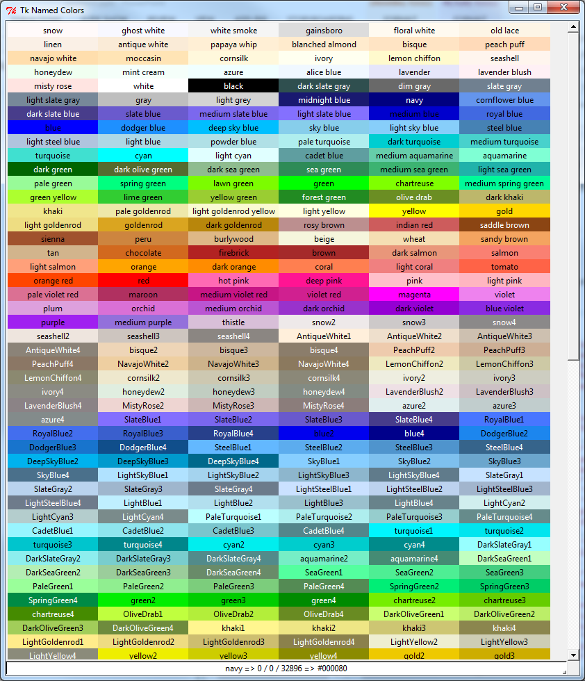
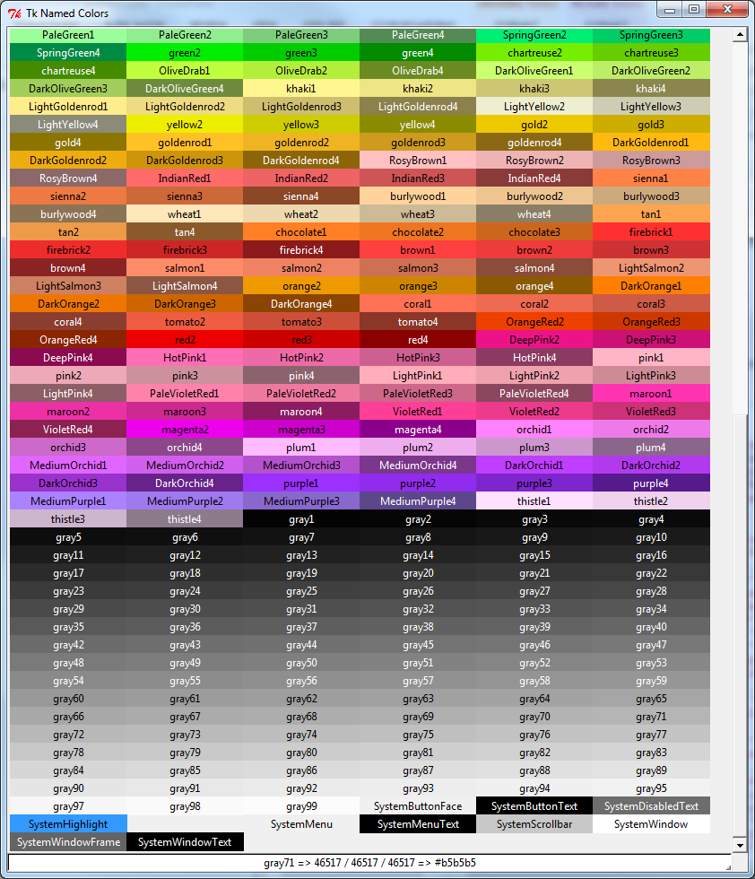

# TkNamedColors
All of the named colors for tkinter.

A long time ago an internet hero made [this post](http://wiki.tcl.tk/16166) that showed a tcl program to list and select any of the named colors in tkinter. This is that tcl code converted to python as faithfully as I know how (no added features or code improvements).

Tested in Windows and Linux, Python2 and Python3. View will resize with the window size. Hover over any color to see the name, 16-bit RGB value as integers, and 8-bit RGB values as hex. Double click any color to copy the color name to the clipboard. Only colors available on your system will be displayed. 

TODO (PRs welcome):
* fix scrollwheel code. I don't know enough tcl. 
