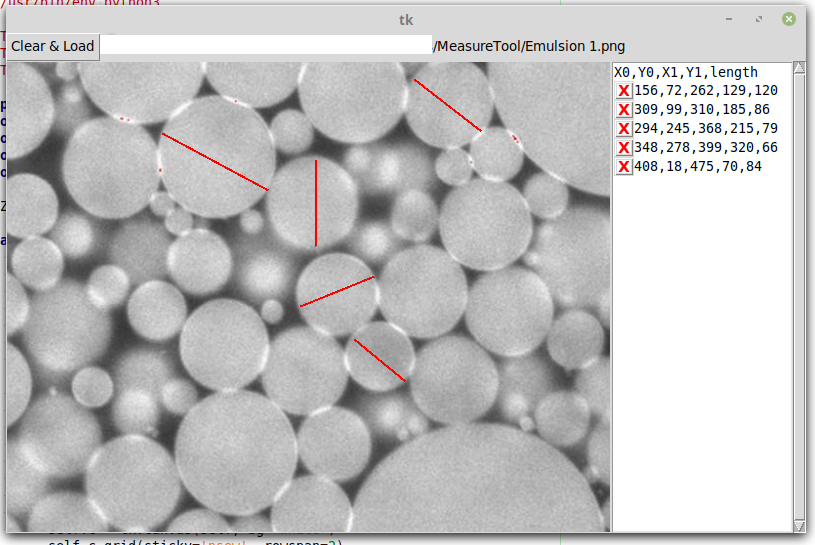

# MeasureTool
A tool to measure random lines drawn on an image. 

Load any image, then use your mouse to draw lines on it. The line positions and lengths appear for you to copy out and use. Click the X next to the coordinates to remove lines you don't like. 

